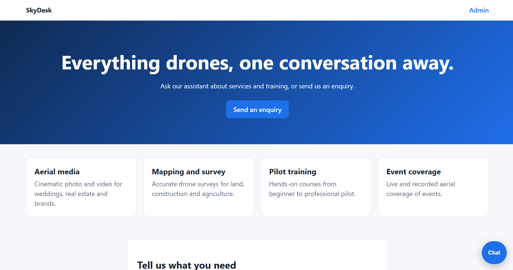
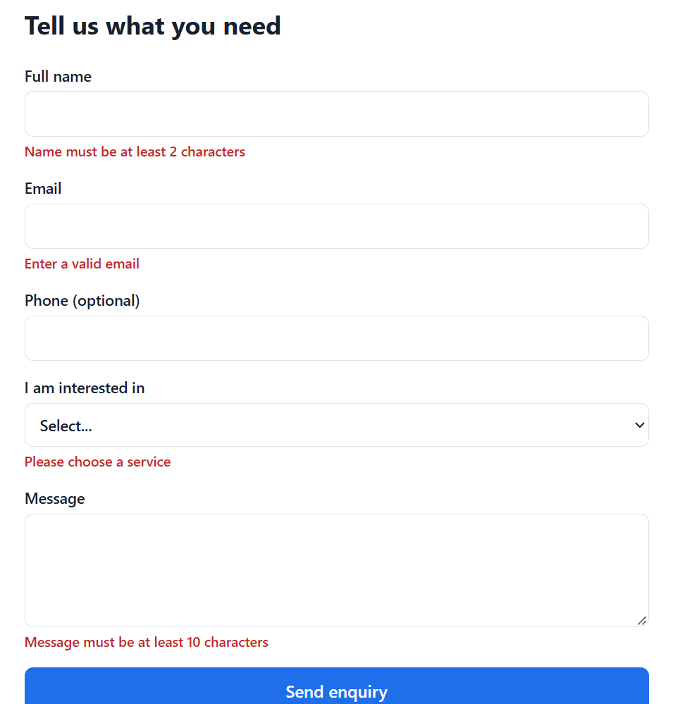
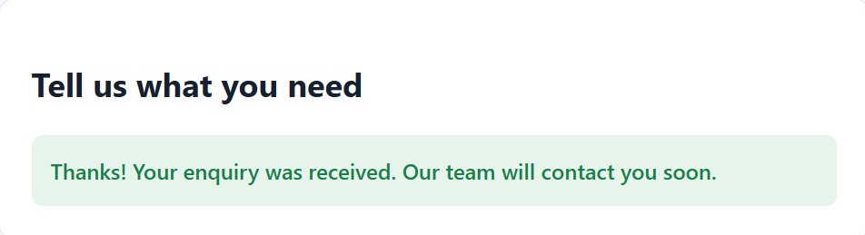
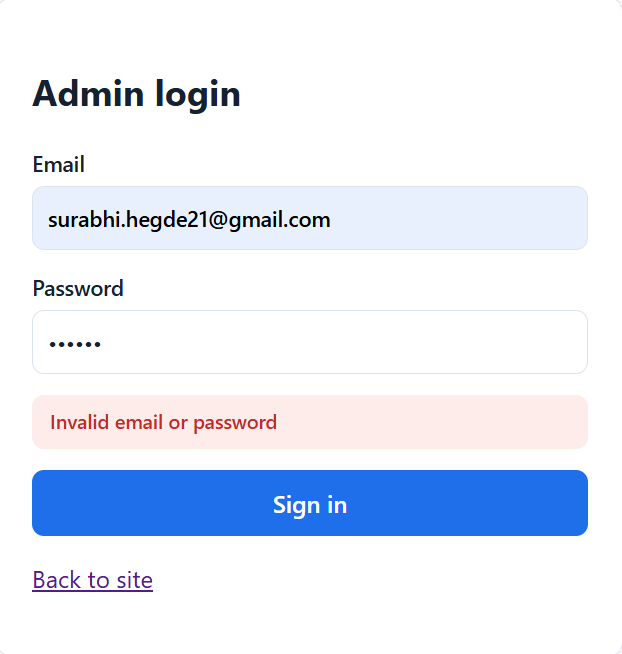
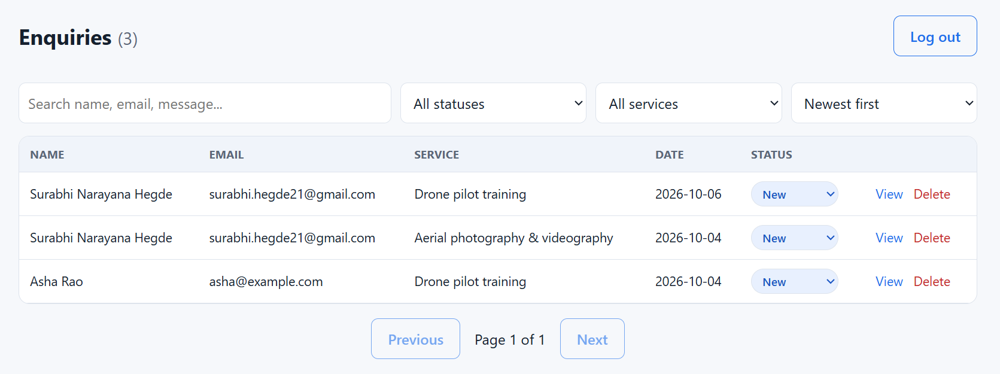
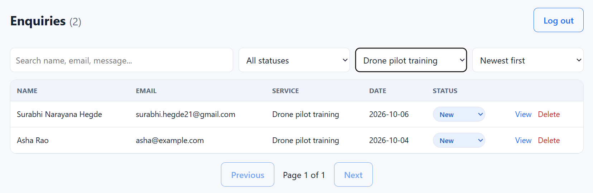

# SkyDesk: Full Stack AI Support & Lead Assistant

A responsive full stack web app for a drone services business. Visitors chat with a rule-based assistant (SkyBot) and submit enquiries. The team manages those leads from a password-protected admin dashboard.

Built as the Full Stack Developer Intern practical assignment for IPAGE Group. 

## Features

- Floating chatbot with keyword-based replies, quick-reply buttons and a fallback message
- Enquiry form (also available inside the chat) with client-side and server-side validation
- Clear error messages, loading states and a success message
- Admin login using JWT
- Admin dashboard with search, status and service filters, sorting and pagination
- Full CRUD: create (public), read, update status and delete (admin only)
- Responsive layout that works on mobile and desktop

## Technologies

| Layer | Technology |
|---|---|
| Frontend | React, TypeScript, Vite, React Router |
| Backend | Node.js, Express, TypeScript |
| Database | SQLite (better-sqlite3) |
| Validation | Zod |
| Security | bcryptjs, JSON Web Tokens, Helmet, CORS, express-rate-limit |

## Project structure

```
FullStack_Chatbot_Task_Surabhi_Hegde/
├── client/                  React + TypeScript frontend
│   └── src/
│       ├── api.ts           All calls to the backend
│       ├── types.ts         Shared types and service list
│       ├── styles.css
│       ├── components/      EnquiryForm, ChatWidget
│       └── pages/           Home, Login, Dashboard
├── server/                  Express + TypeScript backend
│   ├── schema.sql           Database schema
│   └── src/
│       ├── index.ts         Routes, middleware, security
│       ├── db.ts            Database connection and admin seed
│       └── chatbot.ts       Rule-based chatbot logic
├── docs/
│   ├── API_DOCUMENTATION.md
│   └── screenshots/
└── README.md
```

## Setup

Requires Node.js 20 or newer.

### 1. Clone the repository

```bash
git clone https://github.com/YOUR_USERNAME/FullStack_Chatbot_Task_Surabhi_Hegde.git
cd FullStack_Chatbot_Task_Surabhi_Hegde
```

### 2. Backend

```bash
cd server
npm install
cp .env.example .env        
```

Open `server/.env` and set your own values (see the next section), then start the server:

```bash
npm run dev
```

If `npm run dev` is not defined in your `package.json`, run `npx tsx watch src/index.ts` instead.

The API runs at http://localhost:4000

### 3. Frontend

Open a second terminal:

```bash
cd client
npm install
cp .env.example .env        
npm run dev
```

The app runs at http://localhost:5173

- Website and chatbot: http://localhost:5173
- Admin login: http://localhost:5173/admin (use the `ADMIN_EMAIL` and `ADMIN_PASSWORD` from `server/.env`)

## Environment variables

**server/.env**

| Variable | Description |
|---|---|
| `PORT` | Port the API listens on (default 4000) |
| `CLIENT_ORIGIN` | Frontend URL allowed by CORS (default http://localhost:5173) |
| `JWT_SECRET` | Secret used to sign admin tokens. Use a long random value. Required. |
| `ADMIN_EMAIL` | Email of the first admin account, created on first start |
| `ADMIN_PASSWORD` | Password of the first admin account. It is stored hashed. |

Generate a secret with:

```bash
node -e "console.log(require('crypto').randomBytes(32).toString('hex'))"
```

**client/.env**

| Variable | Description |
|---|---|
| `VITE_API_URL` | Base URL of the API (default http://localhost:4000/api) |

No secrets are committed to the repository. `.env` files are ignored by Git, and `.env.example` files contain placeholders only.

## Database setup

There is nothing to install. The app uses SQLite, which stores data in a single file (`server/data.db`).

On startup the server runs `server/schema.sql`, which creates the tables if they do not exist, and creates the first admin from `ADMIN_EMAIL` and `ADMIN_PASSWORD`.

**enquiries**

| Column | Type | Notes |
|---|---|---|
| id | INTEGER | Primary key, auto-increment |
| name | TEXT | Required |
| email | TEXT | Required |
| phone | TEXT | Optional |
| service | TEXT | Required |
| message | TEXT | Required |
| status | TEXT | `new`, `contacted` or `closed` (default `new`) |
| source | TEXT | Default `form` |
| created_at | TEXT | Set automatically |

**admins**

| Column | Type | Notes |
|---|---|---|
| id | INTEGER | Primary key |
| email | TEXT | Unique |
| password_hash | TEXT | bcrypt hash |

To reset the database, stop the server, delete `server/data.db` and start it again.

## API endpoints

| Method | Endpoint | Access | Description |
|---|---|---|---|
| GET | `/api/health` | Public | Health check |
| POST | `/api/chat` | Public | Get a chatbot reply |
| POST | `/api/enquiries` | Public | Create an enquiry |
| POST | `/api/auth/login` | Public | Admin login, returns a token |
| GET | `/api/enquiries` | Admin | List enquiries (search, filters, sort, pagination) |
| GET | `/api/enquiries/:id` | Admin | Get one enquiry |
| PATCH | `/api/enquiries/:id` | Admin | Update an enquiry's status |
| DELETE | `/api/enquiries/:id` | Admin | Delete an enquiry |

Full request and response details are in [docs/API_DOCUMENTATION.md](docs/API_DOCUMENTATION.md).

## Security practices

- Admin passwords are hashed with bcrypt, never stored as plain text
- JWT authentication protects all admin routes, and tokens expire after 8 hours
- All input is validated on the server with Zod
- SQL queries use parameterized statements to prevent SQL injection
- Helmet adds secure HTTP headers
- CORS only allows the configured frontend origin
- Rate limiting on the API, with a stricter limit on login
- Request body size is limited
- Login errors do not reveal whether the email or the password was wrong
- Unexpected errors return a generic message, and details stay in the server log
- Secrets live in `.env` files that are not committed

## Screenshots

| | |
|---|---|
| Home page |  |
| Chatbot |  |
| Enquiry form with validation errors |  |
| Form success |  |
| Admin login |  |
| Admin dashboard |  |
| Search and filters |  |

## How to run (summary)

1. Terminal 1: `cd server`, `npm install`, set up `.env`, `npm run dev`
2. Terminal 2: `cd client`, `npm install`, set up `.env`, `npm run dev`
3. Open http://localhost:5173
